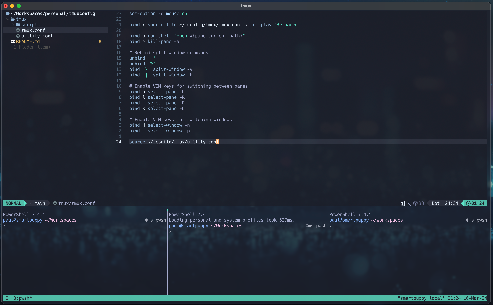

# Minimalizm & Minimalist

> Have you noticed? The world has become much more colorful, mottled, bright and contrasting.

The whole world seems to have gone crazy for the pursuit of brightness, colors, texture, contrast, design and style. Over the past few couple of decades there have been a lot of things that would not have a place to exist without color, bright accents and design. I don't think you have to go very far and the Internet without color would still be a place for geeks and nerds. That time was more for scientists, technicians and just enthusiasts trying to create a virtual world.

The current trend is to scroll through colorful images, photos, and videos, prioritizing flashy presentation over quality.

This shift is also occurring in the IT world, where development programs (IDEs) are becoming increasingly visually complex. The programmer's focus often shifts away from writing quality code, studying algorithms, or understanding for example how the Garbage Collector works (it's .net interview's mem, yet). Unfortunately, this can lead to a lack of focus on important knowledge and skills. Instead, we may become preoccupied with trendy features like beautiful error highlighting and smart assistants. Additionally, it is concerning that many individuals may label themselves as experts in these areas without proper qualifications or experience.

## Minimalizm.

I am pleased to see examples of minimalism in programming and to join the movement. Although I was curious as to why I was only discovering them now, that is a separate matter. I recently discovered enthusiasts who can accomplish tasks in the command line that I couldn't do in Visual Studio or WebStorm. Specifically, I am referring to NeoVim, Tmux, and similar tools that have been in existence for some time but are now being rediscovered by the world.

During my time at university, I had a classmate who wrote code in a notebook. He would then retype the code into a PC in Notepad++ to assemble it, as he did not have any specialized IDEs on his laptop. At the time, I saw this as a display of extreme genius.

Looking back on it now, I realize that he was a true 'samurai' of coding. Reflecting on the process of writing code in Notepad++, I can see the advantages of this approach.

- By not relying on helpers, you can delve deeper into the material you are studying.
- Hotkeys prevent the focus of attention from shifting to other windows, allowing for better concentration.
- Setting up this 'notebook' requires reading and studying a lot of material, which also helps develop critical thinking skills.

## Minimalist.

I discovered the power of minimalism in focusing on the functional core, rather than on unnecessary elements such as marketing or aesthetics. This realization led me to adopt a minimalist approach in my profession.

Initially, I attempted to customize various tools such as Tmux and NeoVim, and experimented with different bundles. I then progressed to developing small projects in C# and TypeScript, before eventually incorporating these tools into my work projects. Throughout this process, I continually reconfigured and refined my approach. Although it took some time, but the feeling of learning something new is rewarding, similar to the satisfaction of a morning run.

While others may go to work with a disgruntled face, the act of learning brings a sense of accomplishment and a better quality of life. It is a step closer to achieving personal goals.

As a result, I have become a big fan of these tools.

[github.com/paulbuzakov/tmuxconfig](https://github.com/paulbuzakov/tmuxconfig)

I have shared my working configuration for my MacBook Pro, home Ubuntu Server, and cloud server.

The **readme.md** file explains my customized keyboard shortcuts that I use for work. While I also use standard shortcuts, you can access them as usual by pressing **`Ctrl + b + ?`**.

## Conclusion.

The topic of minimalism in professional circles can be confusing and is often associated with amateurs. However, there is a certain thrill in opening a simple text editor and with a blank slate customizing it. This allows for a more streamlined and efficient coding process without the need for unnecessary marketing crutches.

This is my personal opinion on the matter. To explore the configuration, visit [github.com/paulbuzakov/tmuxconfig](https://github.com/paulbuzakov/tmuxconfig). If you find it helpful, please consider leaving a star or creating a pull request to suggest an add-on.
